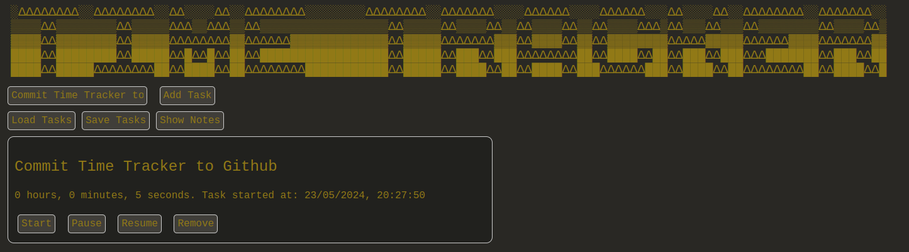

# Task time tracker 

A simple little tool for tracking time spent on tasks, made into a Chrome-based browser extension. 

To use this, at present (as far as I'm aware), grab the source code and run it as an unpacked browser extension.

## Improvements to be done: 
<ol>
<li>Save out the tasks on a refresh so they don't disappear.</li>
<li>Update the save/load logic to use a user-specified file rather than local storage.</li>
<li>DONE - Add start date data to task (Unix timestamp).</li>
<li>(Maybe someday) Get it up on the Chrome Web Store merely as a sharing convenience.</li>
</ol>
